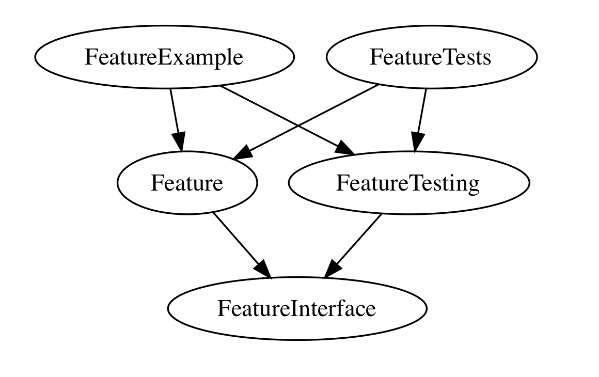
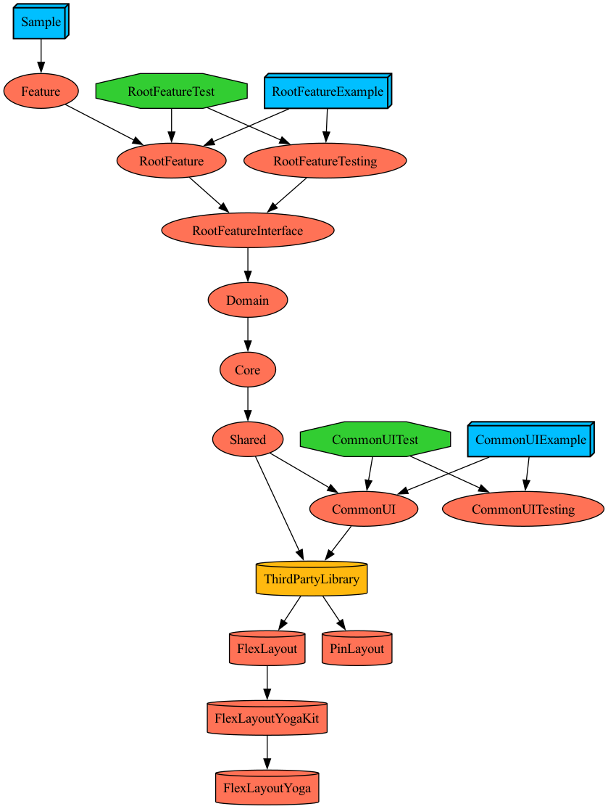

# Tuist Template

## 프로젝트 개요
TMA(Micro Features Architecture)를 기반으로 하여 모듈화된 프로젝트 구조를 갖추고 있으며, 쉽게 프로젝트를 생성하고 관리할 수 있도록 합니다.

## 주요 기능
- **프로젝트 템플릿 제공**
  - TMA(Micro Features Architecture)기반의 프로젝트 템플릿 제공.
  - 각 모듈별 기본 파일 구조와 설정 제공.
    
- **모듈 생성 스크립트**
  - Tuist를 이용한 모듈 생성 스크립트 제공.
  - Interface, Testing, Tests, Example 타겟을 포함한 모듈 생성 가능.
    
## TMA(Micro Features Architecture) 
TMA(Micro Features Architecture)는 프로젝트를 더 작은, 관리하기 쉬운 피처 단위로 분리하여 모듈화하고 확장성을 높이는 아키텍처입니다. 각 기능별로 독립적인 모듈을 구성하여 코드의 유지보수성을 높이고, 각 모듈이 독립적으로 개발, 테스트, 배포될 수 있도록 합니다.

## Layer 설명
- **도메인 관점에 따른 분리 (자주 변하지 않는 영역)**
  - Feature Layer와 Domain Layer는 도메인 관점에서 분리됩니다.
  - 도메인 관점: 애플리케이션의 비즈니스 로직과 사용자가 상호작용하는 기능에 집중합니다. 이 부분은 상대적으로 자주 변하지 않는 영역입니다.
    - Feature Layer: 사용자에게 제공되는 특정 기능을 독립적인 모듈로 분리합니다. UI와 데이터 접근 로직을 포함합니다.
    - Domain Layer: 애플리케이션의 비즈니스 로직과 규칙을 캡슐화합니다. Use Case와 Domain Model을 통해 비즈니스 규칙을 구현합니다.
- **재사용 관점에 따른 분리 (자주 변하는 영역)**
  - Core Layer와 Shared Layer는 재사용성을 극대화하기 위해 분리됩니다.
  - 재사용 관점: 여러 모듈에서 공통적으로 사용될 수 있는 로직과 리소스에 집중합니다. 이 부분은 자주 변할 수 있는 영역입니다.
    - Core Layer: 애플리케이션 전반에서 공통적으로 사용되는 로직과 유틸리티를 포함합니다. 네트워크 관리, 데이터베이스 설정, 공통 상수, 베이스 클래스 등이 포함됩니다.
    - Shared Layer: 여러 모듈에서 공통으로 사용하는 리소스와 컴포넌트를 포함합니다. 예를 들어, 공통 UI 컴포넌트, 스타일, 이미지, 문자열 리소스 등이 포함됩니다.

## 각 레이어의 역할과 디렉토리 구조
- **App Layer**:
  - 주요 엔트리 포인트로, UI와 사용자 인터페이스를 포함합니다.
  - 예: `AppDelegate`, `SceneDelegate`
  - 디렉토리 구조: `Projects/App`

- **Feature Layer**:
  - 독립적인 기능을 관리하는 모듈입니다.
  - 예: 로그인, 프로필 관리
  - 디렉토리 구조: `Projects/Feature/Login`, `Projects/Feature/Profile`

- **Domain Layer**:
  - 비즈니스 로직과 도메인 규칙을 포함하며, 데이터 처리와 연산을 담당합니다.
  - 예: UseCases, Entities
  - 디렉토리 구조: `Projects/Domain/UseCases`, `Projects/Domain/Entities`

- **Core Layer**:
  - 공통 기능과 유틸리티, 기본 설정 등을 포함합니다.
  - 예: Networking, Persistence
  - 디렉토리 구조: `Projects/Core/Networking`, `Projects/Core/Persistence`

- **Shared Layer**:
  - 여러 모듈 간에 공유되는 코드와 리소스를 관리합니다.
  - 예: 공통 UI 컴포넌트, ThirdPartyLibrary
  - 디렉토리 구조: `Projects/Shared/CommonUI`, `Projects/Shared/ThirdPartyLibrary`

## TMA(Micro Features Architecture) 타겟 설명
</img>
- **implements**: 모듈 구현 타겟, 실제 기능.
- **interface**: 모듈의 인터페이스를 정의하는 타겟.
- **testing**: 모듈의 테스트 타겟, Mocking 제공.
- **tests**: 모듈의 유닛 테스트 타겟.
- **example**: 모듈의 예제 애플리케이션 타겟.

## Template 설명
- **Module Template**: `Module.swift`, `Project.stencil`에서 `hasInterface`, `hasTesting`, `hasTests`, `hasExample` 속성에 따라 타겟(tma target)을 조건부로 포함
- **Example Template**: `Example.swift`, `ExampleResources.stencil`, `ExampleSources.stencil` 타겟 기본 파일 생성
- **Interface Template**: `Interface.swift`, `Interface.stencil` 타겟 기본 파일 생성
- **Testing Template**: `Testing.swift`, `Testing.stencil` 타겟 기본 파일 생성
- **Tests Template**: `Tests.swift`, `Tests.stencil` 타겟 기본 파일 생성

## 스크립트 상세 설명(`GenerateModule.swift`)
반복적인 작업을 더 쉽게하기 위한 스크립트
- **레이어 선택**: 사용자가 새로운 모듈을 생성할 때 레이어(Feature, Domain, Core, Shared)를 선택할 수 있도록 합니다
- **모듈 이름 및 타겟 설정**: 사용자가 모듈 이름과 함께 Interface, Testing, Tests, Example 타겟을 선택하여 생성할 수 있도록 함
- **스크립트 실행 흐름**:
  1. 사용자로부터 레이어, 모듈 이름 및 타겟별 생성 여부 선택을 입력받음 
  2. 입력받은 정보를 기반으로 모듈 생성 스크립트를 실행하여 지정된 타겟을 포함한 모듈을 생성
  3. 생성된 모듈이름을 모듈 경로를 나타내는 열거형 타입 ModulePaths.swift 파일에 자동으로 등록하여 프로젝트에 반영
- **스크립트 주요 기능**:
  - 입력 유효성 검사: 사용자가 입력한 값들이 유효한지 검사하여 잘못된 입력에 대해 재입력을 요청 
  - 커맨드 실행: `bash`를 사용하여 `makeModuleScaffold` 함수를 통해 각 타겟별 필요한 스캐폴드를 생성. `tuist scaffold` 명령어를 실행
  - 파일 업데이트: 새로운 모듈 생성 후 필요한 파일들을 자동으로 업데이트
- **모듈 정보 확인**: 입력받은 모듈 정보를 사용자에게 확인시킵니다.
- **모듈 의존성 등록**: `registerModulePaths` 함수를 통해 `ModulePaths.swift` 파일에 경로를 등록합니다.
- **모듈 스캐폴드 생성**: `makeModuleScaffold` 함수를 통해 각 타겟별 스캐폴드를 생성합니다. 여기서는 `tuist scaffold` 명령어를 사용하여 필요한 파일과 디렉토리를 생성합니다.
  
## Makefile 설명
Makefile은 프로젝트의 반복적인 작업을 자동화하는 데 사용됩니다. 예를 들어, 프로젝트를 클린 빌드하거나 테스트를 실행하는 명령어들을 정의할 수 있습니다.
```
generate:
	tuist install
	tuist generate

regenerate:
	tuist clean
	rm -rf **/**/**/*.xcodeproj
	rm -rf **/**/*.xcodeproj
	rm -rf **/*.xcodeproj
	rm -rf *.xcworkspace
	tuist install
	tuist generate

clean:
	tuist clean
	rm -rf **/**/**/*.xcodeproj
	rm -rf **/**/*.xcodeproj
	rm -rf **/*.xcodeproj
	rm -rf *.xcworkspace

module:
	swift Scripts/GenerateModule.swift

```
## 파일 구조
```
.
├── Plugin
│   ├── ConfigurationPlugin
│   ├── DependencyPlugin
│   ├── EnvironmentPlugin
│   └── TemplatePlugin
├── Projects
│   ├── App
│   ├── Core
│   ├── Domain
│   ├── Feature
│   └── Shared
├── Scripts
│   ├── GenerateModule.swift
├── Tuist
├── Workspace.swift
└── README.md
```

## 각 디렉토리 설명
- **Plugin**: Tuist 플러그인 관련 파일들이 위치합니다.
    - ConfigurationPlugin: 프로젝트 구성 설정 관련 플러그인.
    - DependencyPlugin: 의존성 관리 관련 플러그인.
    - EnvironmentPlugin: 환경 설정 관련 플러그인.
    - TemplatePlugin: 템플릿 관련 플러그인.
- **Projects**: 각 모듈별 프로젝트 파일들이 위치합니다.
  - App: 애플리케이션의 진입점이며, 다양한 앱의 엔트리 포인트와 디자인 시스템을 포함.
  - Core: 애플리케이션의 핵심 비즈니스 로직을 포함.
  - Domain: 비즈니스 도메인 로직을 포함.
  - Feature: 특정 기능을 제공하는 모듈.
  - Shared: 여러 모듈에서 공통으로 사용되는 유틸리티 및 확장 기능을 포함.
- **Scripts**: 모듈 생성을 위한 스크립트가 위치합니다.
  - GenerateModule.swift: 모듈 생성을 위한 스크립트 파일.
- **Tuist**: Tuist 관련 설정 파일들이 위치합니다.
- **Workspace.swift**: 워크스페이스 설정 파일입니다.

## 의존성 그래프
</img>

## 참고
- [The Modular Architecture (TMA)](https://docs.tuist.io/guides/develop/projects/tma-architecture#the-modular-architecture-tma)
- [레고처럼 조립하는 토스 앱](https://toss.tech/article/slash23-iOS)
- [Tuist 를 활용해 확장 가능한 모듈 구조 만들기](https://medium.com/daangn/tuist-%EB%A5%BC-%ED%99%9C%EC%9A%A9%ED%95%B4-%EB%AA%A8%EB%93%88-%EA%B5%AC%EC%A1%B0-%EC%9E%90%EB%8F%99%ED%99%94%ED%95%98%EA%B8%B0-f200992d4bf2)
- [Tuist로 모듈화](https://ios-development.tistory.com/1302)
- [Tuist Scaffold, Template 사용한 모듈 만들기](https://baegteun.tistory.com/12)
- [iOS Modular Architecture 를 향한 여정](https://medium.com/29cm/modular-architecture-%EB%A5%BC-%ED%96%A5%ED%95%9C-%EC%97%AC%EC%A0%95-part-1-xcodegen-%EB%8F%84%EC%9E%85%EA%B3%BC-%EB%AA%A8%EB%93%88%ED%99%94%EC%9D%98-%EC%8B%9C%EC%9E%91-19a7f7b6401a)

